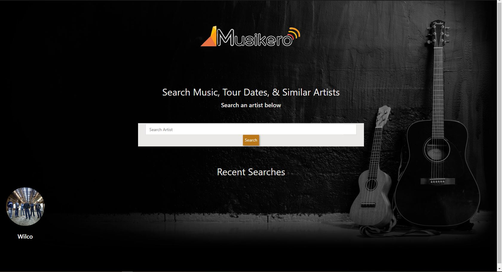
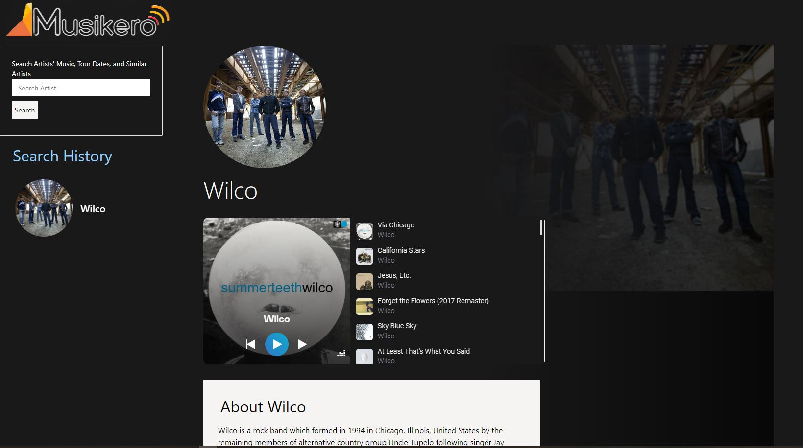

# Musikero App
A music app that allows users to search for artists of interest and view similar artists, a sample playlist, and tour dates.

# User Story
* As a music lover, 
  I want to be able to look up an artist and know when they are in town. 
  So that I can plan accordingly. 

* As a music lover, 
  I want to look up an artist and receive similar artists and find out when they are in town, 
  So that I can find new music. 

* As a music lover, 
  I want to look up an artist and similar artists and receive playlists for all, 
  So that I can explore new music and familiarize myself with their discography. 

# Acceptance Criteria
GIVEN I am interested in learning more about an artist (and similar artists) and their tour dates, or concerts in my area. 
WHEN I search for an artist, 
THEN I receive the artist’s playlists and tour dates and similar artists. 
WHEN I click on a tour date 
THEN I am linked to a place to buy tickets. 
WHEN I look into similar artists, 
THEN I receive their playlists and tour dates. 
WHEN I search for my area and specific dates, 
THEN I receive those dates and links to buy those tickets and links for those artists. 

## https://murpheycm.github.io/artist-search-API/

